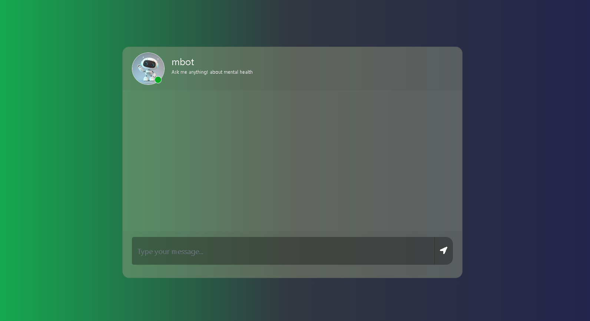

# Mental Health Chatbot with Generative AI

## Project Description

This project is an end-to-end medical and mental health chatbot powered by Generative AI. The chatbot is designed to assist users with mental health-related queries by leveraging advanced natural language processing (NLP) techniques. It uses a combination of Pinecone for vector storage, OpenAI for language generation, and various other technologies to provide accurate and concise answers to user questions.

### Technologies Used

- **Python**: The core programming language used for development.
- **Flask**: A lightweight WSGI web application framework for serving the chatbot.
- **Pinecone**: A vector database for storing and querying embeddings.
- **OpenAI**: For generating responses to user queries.
- **LangChain**: For managing the interaction between the chatbot and the vector database.
- **Hugging Face Transformers**: For embedding generation.
- **Bootstrap**: For responsive and modern UI design.
- **jQuery**: For handling AJAX requests and DOM manipulation.

## Screenshot

